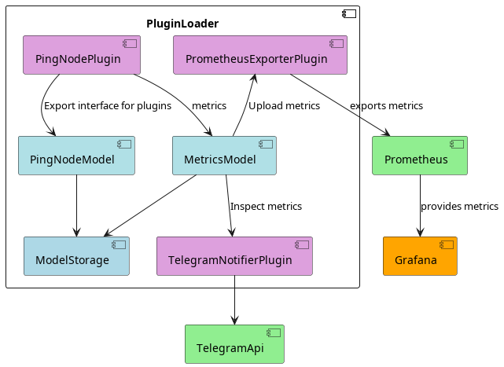

# NodesMonitoring

**NodesMonitoring** is a node monitoring system with Grafana dashboards and Prometheus metrics collection. It allows you to track node latency (ping) and availability, as well as export metrics to Prometheus.

## 🚀 Quick Start
```
git clone https://github.com/d3156/NodesMonitoring.git
cd NodesMonitoring
sh download_plugins.sh
# Optional: edit example configs in ./configs/*
docker compose up -d --build
```
After starting:
- Grafana is available at: http://127.0.0.1:13000/dashboards
- Default credentials:  
    - Login: `admin`
    - Password: `admin`

## Nginx Configuration for Grafana

## 1. Update `docker-compose.yml`:
Replace the URLs with your domain:
```docker-compose
environment:
  GF_SERVER_ROOT_URL: http://localhost:13000/
  GF_SERVER_HTTP_EXTERNAL_URL: http://localhost:13000/
```
## 2. Configure Nginx
Add the following location block to your server section in `nginx.conf` to properly reverse-proxy Grafana under `/grafana/`:
```nginx
    location /grafana/ {
        proxy_pass http://127.0.0.1:13000/;
        proxy_set_header Host $host;
        proxy_set_header X-Real-IP $remote_addr;
        proxy_set_header X-Forwarded-For $proxy_add_x_forwarded_for;
        proxy_set_header X-Forwarded-Proto $scheme;
        proxy_redirect http://127.0.0.1:13000/ /grafana/;
   }
```
Notes:
`proxy_pass` points to your Grafana container’s internal port.
`proxy_redirect` ensures Grafana correctly rewrites URLs when accessed through `/grafana/`.
`X-Forwarded-*` headers preserve client information and protocol.

## 📊 Dashboards

- **Ping Node** — displays node latency and availability metrics.

Example:


## 📝 Configurations

### 1. configs/MetricsModel.json
- `statisticInterval` — statistics collection interval (seconds)
- `stopThreadTimeout` — thread stop timeout (ms)
### 2. configs/PingNode.json
- `ping_interval_sec` — ping interval
- `timeout_ms` — ICMP response timeout
- `icmp_payload` — ICMP packet content
- `nodes` — list of nodes to monitor
### 3. configs/PrometheusExporter.json
- `mode` — operation mode: `pull` (Prometheus scrapes) or `push` (Push Gateway)
- `pull_port` — port for pull metrics
- `push_gateway_url` — Prometheus Push Gateway address
- `job` — Prometheus job name

## Dataflow Diagram

The following diagram illustrates the flow of data and metrics inside the **PluginCore architecture**:



**Description of the dataflow:**

- **ModelStorage** — global storage of models/interfaces for plugins.  
- **PingNodeModel** registers itself in `ModelStorage`.  
- **PingNodePlugin** interacts with `PingNodeModel` to collect and process node data, and sends metrics to `MetricsModel`.  
- **MetricsModel** also stores its data in `ModelStorage`.  
- **PrometheusExporterPlugin** reads metrics from `MetricsModel` and exports them to **Prometheus**.  
- **PluginLoader** orchestrates the plugins and ensures metrics are exported to Prometheus.  
- **Prometheus** serves metrics to **Grafana** for visualization.  

This diagram clarifies how data flows from node monitoring plugins through the models and exporters to the visualization layer.
