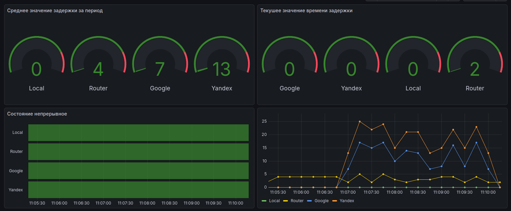

# NodesMonitoring

For look at metrics

```
git clone git@github.com:d3156/NodesMonitoring.git
cd NodesMonitoring
# edit example configs ./configs/*
docker compose up -d --build
```

You can see metrics on http://127.0.0.1:13000/dashboards
Default login `admin` and pass `admin`

In Dashboard `Ping Node` you can see metrics:

